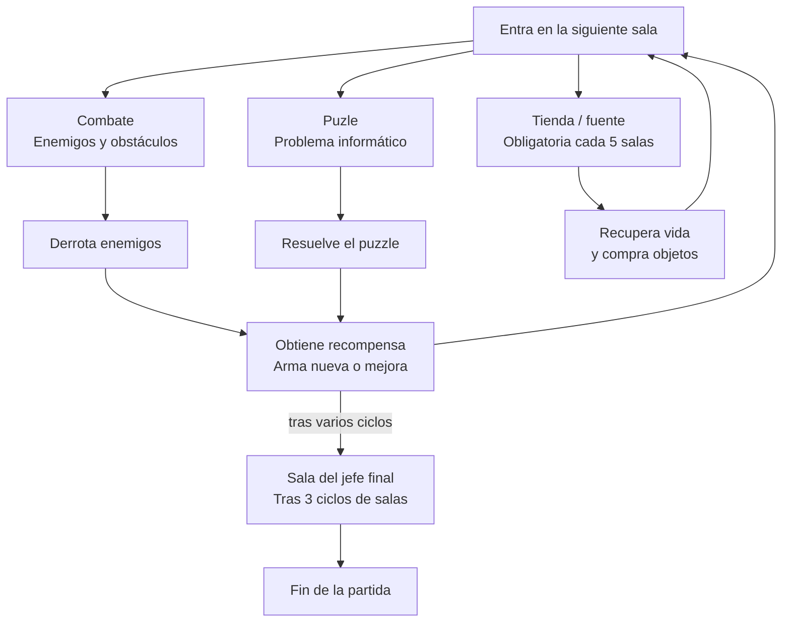

# 404 : Faculty Not Found

## Documento de diseño

**Equipo de desarrollo:**

- Arturo Ramos Romero
- Nicolás Florez Pacheco
- Adrián Montiel Martínez
- Pablo Polegre Martin

**Fecha de la última actualización:** 30/09/2026

---

## 1 Descripción general

### 1.1 Concepto

Es un juego de acción y exploración de salas/mazmorras: se entra en una sala, se limpia de amenazas, y se avanza a la siguiente, cada vez más cerca del jefe final. La progresión no viene de una historia larga, sino de ir mejorando al personaje conforme se avanza.

### 1.2 Género

Roguelike dungeon crawler con vista desde arriba (top-down), centrado en el combate y la exploración sala por sala.

### 1.3 Setting

Nadie recuerda bien cuándo empezó. Un compilador que tardaba demasiado, una pantalla que parpadeó en rojo, y de pronto los pasillos ya no llevaban a donde debían. Quien se quedó esa noche en el laboratorio, terminando una entrega de última hora, cruzó sin querer al otro lado: una copia corrupta y demoníaca de la propia facultad, atrapada entre dimensiones, como el Mundo del Revés de Stranger Things pero lleno de bugs, virus y profesores poseídos.

La facultad sigue ahí, pero rota: las aulas sangran código, los proyectores escupen fuego y algo en la sala de servidores respira. Para volver a casa habrá que abrirse paso sala por sala, derrotando a los monstruos que habitan cada aula, hasta enfrentarse a lo que sea que gobierne ese lugar. Dicen que quien entra puede volver... si sobrevive a las prácticas.

### 1.4 Características principales

- 2D, vista top-down.
- Exploración por salas al estilo dungeon crawler.
- Combate cuerpo a cuerpo y a distancia.
- Progresión mediante objetos y mejoras.
- Obstáculos ambientales por sala.
- Ambientación de terror/humor en clave de facultad demoníaca.
- Presencia de un jefe final al final del recorrido.
- Desarrollo con placeholders; arte definitivo a decidir más adelante.

---

## 2 Gameplay

### 2.1 Objetivo del juego

El objetivo principal del jugador (objetivo a largo plazo del jugador) es escapar de la dimensión, lo cual se consigue derrotando al jefe final. Para llegar a él, es necesario que el jugador haya progresado antes a través de objetivos menores, agrupados en dos categorías: objetivos a medio y corto plazo.

- **Objetivos a medio plazo:**
  - Limpiar cada sala de enemigos y obstáculos para poder avanzar a la siguiente.
  - Conseguir objetos y mejoras que permitan fortalecer al personaje de cara a los desafíos siguientes.
- **Objetivos a corto plazo:**
  - Derrotar a los enemigos presentes en la sala actual.
  - Evitar o superar los obstáculos de la sala actual mientras se combate.
  - Superar los puzzles propuestos en las salas de informática.

La victoria del jugador depende de derrotar al jefe final. En caso de que su vida llegue a 0, el jugador pierde la partida y debe empezar de nuevo.

### 2.2 Core loop

Una vez el jugador comienza la partida desde el menú, deberá avanzar sala por sala hasta alcanzar y derrotar al jefe final, y es en base a este concepto que se estructura el bucle de juego:

---

## 3 Personaje jugador

El Defecto era un alumno diferente que un día de clase normal se quedó en la facultad para terminar un entregable. Hubo un gran temblor y todo se oscureció de manera repentina. De un momento a otro, ya no era un chico normal, sino una criatura mutante, y todo a su alrededor había cambiado: ya no estaba en una universidad, sino en el inframundo…

### 3.1 Métricas

| Métrica | Medida | Descripción |
|---|---|---|
| Vida | Puntos de Salud | Cantidad máxima de vida. Determina cuánto daño puede recibir el jugador antes de morir. |
| Daño | Daño/ataque | Daño que inflige el jugador al atacar contra un enemigo. |
| Velocidad de movimiento | Unidades/s | Velocidad a la que es capaz de moverse el jugador. |
| Velocidad de ataque | Ataques/s | Número de ataques que el jugador es capaz de disparar por segundo. Representa la velocidad con la que es capaz de atacar. |

### Controles

**Teclado/Ratón:**

| Tecla | Acción |
|---|---|
| W | Mover arriba |
| A | Mover izquierda |
| S | Mover abajo |
| D | Mover derecha |
| E | Interactuar |
| W+A | Mover diagonal superior izquierda |
| W+D | Mover diagonal superior derecha |
| S+A | Mover diagonal inferior izquierda |
| S+D | Mover diagonal inferior derecha |
| Hover del ratón | Dirección de los ataques del jugador |
| Click izquierdo | Seleccionar |
| Esc | Menú/Pausar |

**Mando:**

| Botón | Acción |
|---|---|
| ≡ | Menú/Pausar |
| A | Seleccionar |
| B | Interactuar |
| L | Movimiento lateral, vertical, diagonal, moverse por menús |
| R | Dirección de los ataques del jugador |
| ↑ | Mover arriba |
| ↓ | Mover abajo |
| ← | Mover izquierda |
| → | Mover derecha |

---

## 4 Mecánicas

A continuación las mecánicas presentes en nuestro juego:

### Movimiento

La mecánica de movimiento consiste en el desplazamiento del personaje jugador, en teclado se puede mover en las 8 direcciones y en mando en 360º. El jugador se desplaza a una velocidad constante definida por la métrica de velocidad de movimiento del jugador.

### Armas

El sistema de armas consiste en la obtención de las mismas al completar una sala de puzle o comprándolas en la tienda por una cierta cantidad de oro. Estas atacan automáticamente cada cierto tiempo determinado por la velocidad de ataque del jugador y dicha estadística del arma, realizando un daño concreto establecido por la métrica de ataque del jugador y la estadística propia del arma. La dirección del ataque o de los proyectiles disparados es hacia la ubicación del ratón (hover). Al conseguir o comprar un arma que ya se ha adquirido previamente, aumenta su nivel (tier), hasta un máximo de 3, esto mejora sus estadísticas.

### Mejoras

El sistema de mejoras consiste en la obtención de las mismas al completar una sala de combate, derrotando a todos los enemigos de dicha sala, o comprándolas en la tienda por una cierta cantidad de oro. Estas aumentan las estadísticas del jugador o también añaden otras ventajas para el mismo.

### Vida

El jugador tiene una estadística de vida máxima la cual puede ser aumentada mediante las mejoras de vida. Si el personaje recibe un ataque de un enemigo, pierde la cantidad de vida equivalente al ataque de dicho enemigo. Si la vida del jugador llega a 0, es derrotado y la partida acaba. Por otra parte, el jugador puede recuperar vida en las salas de recuperación, donde también se encuentra la tienda.

### Combate

En el combate con los enemigos, el jugador ataca con sus armas apuntando con el ratón mientras se mueve tratando de esquivar los proyectiles/ataques de los enemigos. En función del arma del jugador este se deberá acercar para atacar cuerpo a cuerpo o alejarse y disparar a distancia. Los enemigos se comportan igual, acercándose al jugador para atacar si son enemigos cuerpo a cuerpo o manteniéndose a un rango determinado si son enemigos a distancia.

### Tienda

En la tienda el jugador puede comprar armas y mejoras mediante el pago de una cierta cantidad de oro. Dicho oro se obtiene al derrotar enemigos en la sala de combate y la cantidad de oro recogida se puede llegar a ver modificada por la mejora "Suerte". Hay 3 opciones posibles distribuidas entre todas las armas y mejoras disponibles en el juego. Se aplica el descuento adecuado en caso de poseer la mejora correspondiente.

### Sistema de salas

Cada vez que el jugador se adentra en una sala, esta se escoge aleatoriamente, ya sea de puzle o de combate. Sin embargo, cada 5 salas comunes (combate/puzle) la siguiente sala es una de tienda y recuperación de vida obligatoriamente. Como mínimo habrá 1 sala de puzle entre esas 5. Después de repetir este ciclo 3 veces, el jugador entra en la sala del jefe final.

---

## 5 Mundo del juego

### 5.1 Personajes

#### 5.1.1 Elementos comunes

Todos los enemigos comparten las siguientes características: infligen daño al colisionar con el jugador, cuentan con una cantidad de vida propia y, al ser derrotados, pueden soltar algún tipo de recompensa (moneda u objeto). No existe fuego amigo entre enemigos: sus ataques y proyectiles solo afectan al jugador.

**Parámetros y detalles (Enemigos)**

| Parámetro | Unidad de medida | Descripción |
|---|---|---|
| Vida | Puntos de Salud (HP) | Cantidad de daño que puede recibir el enemigo antes de ser derrotado. |
| Daño | Daño por Ataque (DPA) | Cantidad de daño que inflige el enemigo al impactar su ataque contra el jugador. |
| Velocidad | Unidades por Segundo (UPS) | Velocidad a la que se desplaza el enemigo por la sala. |
| Distancia de activación | Unidades (U) | Distancia a la que debe estar el jugador para que el enemigo pase de inactivo a activo. |
| Velocidad de ataque | Ataques por Segundo (APS) | Número de veces que ataca el enemigo por segundo. |
| Velocidad del proyectil | Unidades por Segundo (UPS) | Velocidad a la que se desplaza el proyectil disparado por el enemigo. |
| Alcance | Unidades (U) | Distancia relevante para el ataque del enemigo (radio de explosión, distancia de disparo o distancia de mantenimiento respecto al jugador, según el tipo). |

**Enemigos**

| Nombre | Descripción/Comportamiento | Métricas |
|---|---|---|
| Bug | Se mueve de forma errática por la sala, sin seguir una trayectoria fija hacia el jugador. Ataca únicamente por contacto. | Vida (baja), Daño (bajo), Velocidad (alta) |
| Pop-up | Permanece oculto en la sala hasta que se manifiesta junto al jugador para ejecutar una explosión de área, muriendo inmediatamente después. | Vida (muy baja), Daño (alto), Alcance (medio) |
| Troyano | Permanece inactivo, camuflado como un objeto del entorno, hasta que el jugador entra dentro de su distancia de activación. Al activarse, persigue al jugador y ataca por contacto. | Vida (media), Daño (medio), Velocidad (media), Distancia de activación (baja) |
| Spambot | Mantiene una distancia respecto al jugador (su Alcance) y dispara ráfagas continuas de proyectiles débiles mientras permanece dentro de dicha distancia. | Vida (baja), Daño (bajo), Velocidad (baja), Velocidad de ataque (alta), Velocidad del proyectil (media), Alcance (alto) |
| Profesor corrupto (élite) | Enemigo de mayor tamaño y presencia. Se desplaza más lento que el resto de enemigos comunes, pero compensa esta debilidad con mayor vida y mayor daño por contacto. | Vida (muy alta), Daño (alto), Velocidad (muy baja) |

### 5.2 Objetos

Existen dos categorías principales de objetos: armas y mejoras.

#### 5.2.1 Armas

El jugador puede conseguir dos tipos de armas, una de cuerpo a cuerpo y otra a distancia, ambas ambientadas en la temática informática del juego.

**Cuerpo a cuerpo:**

| Nombre | Descripción | Métricas |
|---|---|---|
| Teclado mecánico (Espada) | Arma equilibrada que inflige una cantidad moderada de daño físico con una velocidad de ataque media, en la dirección hacia la que apunta el jugador. Ofrece un balance estándar entre daño y cadencia. | Daño (medio), Velocidad de ataque (media), Área de daño (media) |
| Torre/CPU en llamas (Maza) | Arma pesada que inflige una cantidad elevada de daño físico con una velocidad de ataque lenta, en la dirección hacia la que apunta el jugador. Compensa su lentitud con un área de impacto mayor, ideal para golpear a varios enemigos agrupados. | Daño (alto), Velocidad de ataque (baja), Área de daño (alta) |
| Cable Ethernet/HDMI (Látigo) | Arma tipo látigo que inflige daño físico rápidamente a un alcance medio, en la dirección hacia la que apunta el jugador. Sacrifica daño por impacto a cambio de mayor frecuencia de golpe y alcance, permitiendo golpear sin necesidad de acercarse tanto como con el resto de armas cuerpo a cuerpo. | Daño (bajo), Velocidad de ataque (alta), Área de daño (baja), Alcance (medio) |

**A distancia:**

| Nombre | Descripción | Métricas |
|---|---|---|
| USB de comandos (pistola) | Arma ligera que dispara "comandos" de forma rápida pero con un daño reducido por impacto, en la dirección hacia la que apunta el jugador. Ideal para mantener presión constante a corta-media distancia. | Daño, Velocidad de ataque (alta), Velocidad del proyectil, Alcance (medio) |
| Impresora portátil (fusil de asalto) | Arma que dispara ráfagas de hojas afiladas con un daño moderado por impacto y una cadencia de disparo intermedia, en la dirección hacia la que apunta el jugador. Ofrece un equilibrio entre daño y frecuencia de ataque. | Daño (medio), Velocidad de ataque (media), Velocidad del proyectil, Alcance (medio-alto), Tamaño de ráfaga |
| Router/antena Wi-Fi (francotirador) | Arma de disparo lento que lanza un único "paquete de datos" cargado con un daño elevado y capaz de atravesar a varios enemigos en línea recta, en la dirección hacia la que apunta el jugador. Penaliza la cadencia a cambio de gran alcance y daño. | Daño (alto), Velocidad de ataque (baja), Velocidad del proyectil, Alcance (alto), Penetración (nº de enemigos atravesados) |

#### 5.2.2 Mejoras

Objetos que el jugador puede conseguir al derrotar a todos los enemigos de una sala de combate, o comprar en la tienda mediante una cierta cantidad de oro. Aumentan las estadísticas del jugador o le otorga alguna ventaja adicional. Salvo que se indique lo contrario, todas las mejoras son acumulables: pueden obtenerse varias veces a lo largo de la partida, sumando su efecto cada vez.

**Parámetros y detalles (Mejoras)**

| Parámetro | Unidad de medida | Descripción |
|---|---|---|
| Aumento de Vida máxima | Puntos de Salud (HP) | Cantidad que incrementa la vida máxima del jugador por cada mejora obtenida. |
| Aumento de Daño | Daño por Ataque (DPA) | Cantidad que incrementa el daño base del jugador por cada mejora obtenida. |
| Aumento de Velocidad de ataque | Ataques por Segundo (APS) | Cantidad que incrementa la velocidad de ataque del jugador por cada mejora obtenida. |
| Reducción de precio | Porcentaje (%) | Porcentaje que reduce el precio de los objetos disponibles en la tienda. |
| Probabilidad de oro extra | Porcentaje (%) | Probabilidad de obtener una cantidad adicional de oro cada vez que el jugador recoge oro. |

**Tabla de mejoras**

| Nombre | Descripción | Métricas |
|---|---|---|
| Antivirus | Aumenta la vida máxima del jugador. Si no tiene la vida al completo en el momento de obtenerla, recupera además la cantidad de vida aumentada. | Aumento de Vida máxima |
| Overclock | Aumenta el daño base del jugador en una cantidad determinada. | Aumento de Daño |
| Turbo | Aumenta la velocidad de ataque del jugador en una cantidad determinada. | Aumento de Velocidad de ataque |
| Licencia crackeada | Reduce el precio de los objetos de la tienda (armas y mejoras) en un porcentaje concreto. | Reducción de precio |
| Suerte (no acumulable) | Otorga al jugador una probabilidad de obtener una cantidad extra de oro cada vez que recoge oro, con un porcentaje de posibilidad determinado. | Probabilidad de oro extra |

### 5.3 Obstáculos

Los obstáculos son elementos del entorno de cada sala que condicionan el movimiento o infligen algún efecto negativo al jugador, sin llegar a ser enemigos.

**Tabla de obstáculos**

| Nombre | Descripción/Comportamiento | Métricas |
|---|---|---|
| Suelo corrupto | Zona del suelo que inflige daño continuo al jugador mientras permanece sobre ella. | Daño, Área de efecto |
| Pantallazo azul (BSOD) | Zona que, al ser pisada, inmoviliza brevemente al jugador. | Duración de inmovilización, Área de efecto |
| Cables sueltos | Obstáculo físico y estático que bloquea el paso por una zona de la sala. | Área de efecto |
| Zona de lag | Zona que reduce la velocidad de movimiento del jugador mientras permanece dentro de ella. | Porcentaje de ralentización, Área de efecto |

#### 5.3.1 Parámetros y detalles (Obstáculos)

| Parámetro | Unidad de medida | Descripción |
|---|---|---|
| Daño | Daño por Segundo (DPS) | Cantidad de daño que inflige el obstáculo al jugador por cada segundo que permanece dentro de su área de efecto. |
| Duración de inmovilización | Segundos (s) | Tiempo durante el cual el jugador no puede moverse tras activar el obstáculo. |
| Porcentaje de ralentización | Porcentaje (%) | Porcentaje en el que se reduce la velocidad de movimiento del jugador mientras permanece dentro del área de efecto. |
| Área de efecto | Unidades cuadradas (U²) | Superficie de la sala que ocupa el obstáculo y dentro de la cual afecta al jugador. |

### 5.4 Niveles

El juego se estructura en salas conectadas entre sí, agrupadas por zonas temáticas correspondientes a distintas áreas de la facultad (aulas, laboratorios, biblioteca, sala de servidores...), a modo de bloques progresivos de dificultad creciente. Cada bloque culmina en una sala de mayor desafío antes de dar paso al siguiente.

El número total de salas, su disposición exacta y los bocetos de nivel quedan pendientes de definir en una fase posterior del desarrollo. Del mismo modo, queda pendiente establecer la unidad de medida del grid de juego (tamaño de sala y tamaño del jugador respecto a dicha unidad), necesaria para mantener coherencia con el resto de parámetros del documento.

---

## 6 Interfaz

### 6.1 Cámara

Cámara ortográfica fija por sala, con vista cenital (top-down). Cada sala cabe por completo en pantalla, sin scroll ni seguimiento del jugador: el encuadre permanece estático durante el combate, de modo que el jugador ve en todo momento a todos los enemigos, proyectiles y obstáculos presentes. Este planteamiento se toma de *The Binding of Isaac*.

Al cruzar una puerta, la cámara no corta en seco a la sala contigua: realiza un desplazamiento lateral rápido (aproximadamente 0,3–0,5 s), reforzando la sensación de recorrer un edificio continuo en lugar de teletransportarse entre pantallas independientes.

### 6.2 HUD

El HUD se mantiene mínimo y pegado a las esquinas, dejando el centro de la pantalla libre para el combate. Toda la información se apoya en iconografía informática coherente con la ambientación, evitando texto siempre que sea posible.

**Elementos fijos:**

| Elemento | Ubicación | Comportamiento |
|---|---|---|
| Vida | Esquina superior izquierda | Contenedores de vida representados como iconos de batería/chips, que se vacían progresivamente al recibir daño. |
| Oro | Bajo la vida, esquina superior izquierda | Contador numérico con icono; se incrementa al recoger oro. |
| Armas equipadas | Esquina inferior izquierda | Dos ranuras (cuerpo a cuerpo y a distancia) con el icono del arma equipada; la ranura activa se resalta con mayor opacidad, y se indica el nivel (tier) actual del arma (hasta 3). |
| Mejoras obtenidas | Franja inferior izquierda, junto a las armas | Fila de iconos pequeños con las mejoras acumuladas durante la partida. |
| Barra de vida del jefe | Franja superior centrada | Visible únicamente durante el enfrentamiento final, junto al nombre del jefe. |

**Interfaz contextual de interacción:** cuando el jugador se encuentra dentro del radio de detección de una entidad interactuable (arma en el suelo, terminal de puzzle, etc.), se muestra un pequeño prompt flotante justo encima del personaje, indicando la tecla y la acción disponible (por ejemplo, *"F: Recoger arma"* o *"Q: Iniciar puzzle"*). Este elemento no ocupa una posición fija del HUD, sino que aparece y desaparece dinámicamente según la mecánica de Interacción (véase 4. Mecánicas).

**Retroalimentación visual (sin ocupar HUD fijo):**

- Viñeta roja en los bordes de la pantalla y breve parpadeo del sprite al recibir daño.
- Números o destellos de daño sobre los enemigos impactados, para hacer legible la diferencia entre armas.
- Indicadores de aviso en el suelo (áreas marcadas antes del impacto) para los ataques de área del jefe y del Pop-up.

### 6.3 Menús

Todos los menús mantienen la estética de terminal/sistema operativo corrupto: fuente monoespaciada, marcos de ventana tipo escritorio antiguo y pequeños glitches en las transiciones, en la línea de *Undertale*.

**Menú principal:**

- Jugar (inicia una nueva partida en la sala inicial).
- Controles (esquema de teclado/ratón y mando).
- Opciones (volumen de música y efectos, resolución, sacudida de cámara activable).
- Créditos.
- Salir.

> *[Boceto: pantalla negra con un recuadro grande etiquetado "ARTE" y, debajo, cinco botones: JUGAR, CONTROLES, OPCIONES, CRÉDITOS, SALIR.]*

**Menú de pausa** (tecla Esc / botón Start). Detiene el juego y muestra: Reanudar, Controles, Opciones, Abandonar partida. Puede incluir además una pestaña con las mejoras obtenidas y las estadísticas actuales del personaje, a modo de hoja de personaje.

> *[Boceto: pantalla negra con cinco botones apilados: REANUDAR, ESTADÍSTICAS, CONTROLES, OPCIONES, ABANDONAR PARTIDA.]*

**Pantalla de derrota.** Aparece al llegar la vida del jugador a 0, con un texto temático (por ejemplo, *"404: Not Found"*), un resumen de la partida (salas superadas, enemigos derrotados, mejoras conseguidas) y las opciones Reintentar y Volver al menú principal.

> *[Boceto: fondo azul claro con el título "404: PLAYER NOT FOUND" y los botones "Reintentar" y "Rendirse".]*

**Pantalla de victoria.** Aparece tras derrotar al jefe final, con un resumen equivalente de la partida y las opciones Volver al menú principal y Salir.

> *[Boceto: fondo azul claro con el título "302: Win Found", un recuadro con "Kills / Monedas Gastadas / Mejoras / Tiempo" y los botones "Volver al Menú" y "Salir".]*

**HUD:** El HUD se distribuye en las esquinas de la pantalla, dejando el centro libre para el combate. La vida se muestra arriba a la izquierda mediante viales que se vacían al recibir daño. Las armas equipadas se sitúan abajo a la izquierda, con un icono por ranura. Las mejoras obtenidas se agrupan abajo a la derecha, en un icono resumen con acceso a su listado.

> *[Boceto: viales de vida arriba a la izquierda, iconos de espada y pistola abajo a la izquierda, e icono de oro con botón "Mejoras" abajo a la derecha.]*

**Menú de tienda:** Se abre al entrar en una sala de tienda, deteniendo el desplazamiento libre del personaje mientras permanece activa. Muestra la cantidad de oro disponible y presenta tres opciones de compra de mejoras de armas y tres de mejoras, disponibles junto con sus precios, permitiendo al jugador confirmar o cancelar cada adquisición individualmente. La pantalla no bloquea el acceso a la fuente de recuperación de vida de la misma sala, y se cierra automáticamente al abandonar la zona de la tienda o al salir de la sala.

> *[Boceto: marco con título "TIENDA", contador "MONEDAS", una fila de tres ranuras ARMA 1–3 y otra de tres ranuras MEJORA 1–3.]*

**HUD puzle:** Se abre al interactuar con la terminal de una sala de puzzle (tecla Q), sustituyendo temporalmente la vista de la sala. Presenta el problema informático propuesto, junto con las opciones. Al completarlo con éxito, el jugador obtiene un arma al azar y la pantalla se cierra, abriéndose la puerta de salida de la sala.

> *[Boceto: recuadro "PROBLEMA" arriba y, debajo, botones OPCIÓN 1, OPCIÓN 2, OPCIÓN 3 y "…".]*

---

## 7 Experiencia de Juego

Un ejemplo de experiencia de juego sería el siguiente:

El jugador inicia la partida, apareciendo en una sala inicial con dos armas diferentes: una cuerpo a cuerpo y otra a distancia. Sin ningún desafío al que enfrentarse, avanza a la siguiente sala.

El jugador accede a la siguiente sala en la que se encuentra a una serie de enemigos que tratan de acabar con él. Esta, así mismo, cuenta con una serie de obstáculos que el jugador sortea mientras lucha contra los enemigos y los derrota poco a poco usando sus armas. El jugador recibe daño en el proceso, ya sea al entrar en contacto con un enemigo cuerpo a cuerpo o con el proyectil de uno a distancia. Una vez ha derrotado a todos, el jugador escoge una de entre tres mejoras que se le ofrecen, la que más le conviene, y avanza a la siguiente sala.

En dicha sala, el proceso se repite (derrota a los enemigos, sufre un poco de daño y obtiene una mejora. La siguiente sala, sin embargo, le lleva a una sala con un puzzle de programación que el jugador supera para obtener un arma al azar.

Así el jugador avanza de sala en sala (algunas de combate y otras de puzzles) hasta llegar a una sala con una fuente que le recupera la vida perdida y una tienda que le permite comprar ciertas mejoras y niveles de arma. Este ciclo se repite varias veces hasta que finalmente llega al enfrentamiento final. En todo el recorrido el jugador ha obtenido varias mejoras y armas que le hacen avanzar con seguridad. Así, el enfrentamiento empieza y el jugador hace uso de todo lo aprendido en el recorrido: usa sus armas de forma estratégica, evita los obstáculos y analiza los patrones del jefe para evitar en la medida de lo posible sus ataques, modificando su plan de ataque repetidas veces. Así, de manera estratégica, logra derrotar al jefe final y acabar la partida victorioso.

---

## 8 Dinámicas

La jugabilidad se verá definida por las armas y mejoras que el jugador consiga a lo largo de la partida (superando combates, resolviendo puzzles o comprándolas en la tienda) y de la estrategia que adopte en base a esto último.

### 8.1 Jugabilidad deseada

Se busca que el jugador se enfrente a los enemigos propuestos aprovechando las armas con las que cuenta, así como los obstáculos presentes en el entorno, que explore las diferentes mejoras y estrategias posibles para encontrar aquella que él considere la más eficaz o cómoda. Todos los aspectos que influyen en el estilo de juego son los siguientes:

### 8.2 Tipos de enemigos

Los diferentes tipos de enemigos influyen bastante en la jugabilidad, obligando a desarrollar determinadas estrategias. La existencia de enemigos cuerpo a cuerpo y a distancia busca impedir que el jugador se decante por un estilo de juego basado completamente en el daño físico o en el daño a distancia, obligándole a no descuidar ambos apartados.

Un caso más concreto es el de los enemigos Pop-up y Troyano que, con sus respectivas mecánicas, buscan evitar que el jugador se confíe, y así lograr que se encuentre alerta en todo momento en las salas de combate. Otro caso a destacar es el del Profesor corrupto, que penaliza al jugador por tener un estilo agresivo, basado en el combate brusco sin estrategia, obligándole a desarrollar una o, al menos, a ser más prudente.

El enemigo que resulta más desafiante es el jefe final, cuya finalidad es obstaculizar de forma extrema el intento del jugador por llevar a cabo su estrategia previa. Busca llevarle al límite, obligarle a improvisar y a adaptarse a sus ataques. Así, el jugador deberá modificar su estrategia varias veces a lo largo del enfrentamiento, aprovechando sus armas y mejoras, para así llevarse la victoria.

Con todo esto se busca que el jugador se decante por un estilo de combate concreto sin dejar ciertas debilidades sin cubrir.

### 8.3 Mejoras y armas

La obtención de las mejoras y las armas también influye en la jugabilidad. Al ser un aspecto basado en la aleatoriedad, la estrategia que adopta el jugador puede variar de manera repentina, pues este no controla las opciones entre las que podrá elegir y, por ende, no siempre podrá escoger la que más le convenga. Con esto, evitamos que el jugador tenga un estilo monótono, favoreciendo la improvisación y la evaluación de la situación.

La tienda ayuda a darle un mayor control al jugador sobre aquellas mejoras y armas que consigue, sin embargo, no elimina la aleatoriedad, por lo que el jugador tendrá que ser prudente igualmente a la hora de escoger.

El límite impuesto a las armas que puede llevar el jugador también destaca en este apartado, pues le obliga a pensar aún más las decisiones con respecto a las armas, aportando al objetivo de incentivar el análisis de la situación por parte del jugador.

### 8.4 Vida

Durante los combates, el daño recibido por el jugador no se recupera de ninguna forma. Las mejoras de aumento de vida, incrementan el valor de la vida máxima así como el actual, sin embargo, no llegan a regenerar el valor de vida perdido en los combates. De esta forma, la fuente de recuperación de vida se mantiene como la única forma de regenerar vida. Esta escasez de métodos busca incentivar al jugador a tener más precaución con los enemigos y los obstáculos. Estos últimos no solo suponen un riesgo para la vida del jugador, sino que también cuentan con distintos efectos secundarios que el jugador tendrá que tener en cuenta a la hora de desplazarse por la sala.

### 8.5 Estrategias detectadas

En base a todo lo propuesto antes, el jugador puede tener tres estilos de juego diferentes:

- Uno basado principalmente en el uso de armas cuerpo a cuerpo, con un estilo de juego relativamente agresivo, manteniéndose siempre alerta. El jugador buscaría tener mejoras de aumento de daño, de vida y de velocidad de ataque, o incluso aquellas centradas en la tienda para así tener un mayor control sobre su partida y quizás sobre la obtención de armas. Le dará mayor importancia a la vida que en otros estilos para así poder recibir golpes en caso de fracasar en sus intentos de atacar a otros enemigos.
- Uno basado principalmente en el uso de armas a distancia, con un estilo de juego prudente, manteniendo las distancias. El jugador buscaría mejoras muy similares a las del anterior estilo por los mismos motivos, sin embargo, le daría menor importancia a la vida, pues al mantener distancias las probabilidades de salir herido serían menores.
- Uno mixto, con armas de ambos tipos. En el que el jugador combinaría ambos estilos, escogiendo las mejoras según se decantara y cubriendo las debilidades de ambos estilos por separado.

Todos estos estilos requieren un estado de alerta constante en los combates y analizar todos los elementos de la sala.

---

## 9 Estética y contenido

La estética no está fijada por completo y está sujeta a cambios.

### 9.1 Dirección artística

Pixel art 2D en vista cenital, con sprites trabajados sobre un tileset; personaje de 1-1,5 tiles, pantallas de 32 tiles (valores de referencia, sujetos a ajuste). El tono buscado es el de terror con humor: una facultad reconocible (pupitres, proyectores, pizarras, torres de servidores) pero degradada y contaminada por lo digital.

La suciedad y lo orgánico-repulsivo se toman de *The Binding of Isaac*, mientras que de *Hades* se toma la legibilidad: por muy cargada que esté la sala, el jugador, los enemigos y los proyectiles deben distinguirse de un vistazo. Esto se traduce en fondos de contraste bajo y desaturado frente a personajes y proyectiles de contraste alto.

Paleta propuesta: base oscura de grises azulados y morados (pasillos, aulas apagadas) con acentos de verde fósforo de terminal, magenta y rojo de error para todo lo peligroso.

Regla de color funcional: todo lo que daña al jugador se dibuja en tonos cálidos (rojo/naranja) y todo lo que le beneficia en tonos fríos o verdes — mismo criterio empleado en *Dead Cells* para mantener la claridad en pantalla.

### 9.2 Necesidades de arte

- **Jugador:** sprite de El Defecto con animaciones de idle, caminar en 4 direcciones, ataque cuerpo a cuerpo, disparo, recibir daño y muerte.
- **Enemigos:** Bug, Pop-up (incluye animación de aparición y explosión), Troyano (forma camuflada y forma activa), Spam-bot y Profesor corrupto; cada uno con idle, movimiento, ataque y muerte.
- **Jefe final:** sprite de mayor tamaño con un set de animaciones por ataque, pendiente de definir junto al propio diseño del jefe.
- **Tilesets:** uno por zona temática (aulas, laboratorios, biblioteca, sala de servidores), con variantes de suelo, paredes y puertas (abierta/cerrada/especial).
- **Props:** pupitres, sillas, ordenadores, estanterías, cables, racks y pizarras; algunos deben ser coherentes con el camuflaje del Troyano.
- **Obstáculos:** Suelo corrupto (animado), Pantallazo azul, Cables sueltos y Zona de lag, todos con lectura visual inmediata de su área de efecto.
- **Objetos:** iconos de las seis armas y del conjunto de mejoras, más sus sprites en el suelo.
- **Interfaz:** iconos de vida, oro, armas y mejoras; marcos y tipografía monoespaciada de los menús; icono/prompt contextual de interacción (tecla + acción) mostrado sobre el personaje al detectar una entidad interactuable.

### 9.3 Música

Banda sonora electrónica que mezcla chiptune con sintetizadores oscuros, de manera que la ambientación universitaria y la infernal convivan. Se plantean las siguientes piezas:

- **Menú principal:** tema atmosférico y pausado, con zumbido de ventilador de ordenador de fondo.
- **Exploración:** tema ambiental de baja intensidad que suena en salas ya despejadas y pasillos.
- **Combate:** tema de mayor ritmo y percusión que arranca al cerrarse las puertas de una sala y se corta al derrotar al último enemigo. La transición dinámica entre la capa de exploración y la de combate es un recurso característico de *Hades*, y refuerza el ritmo del core loop.
- **Salas de puzzle:** variante más tranquila y curiosa, sin percusión agresiva.
- **Jefe final:** tema propio, más largo y con estructura marcada.
- **Victoria y derrota:** dos piezas breves de cierre.

### 9.4 Efectos de sonido

El audio es clave para que las armas informáticas resulten reconocibles y satisfactorias; cada una debería sonar a lo que es antes que a un arma genérica.

1. **Jugador:** pasos según la superficie, daño recibido, muerte, recogida de objetos y de monedas, y confirmación sonora al interactuar (recoger arma / iniciar puzzle).
2. **Armas cuerpo a cuerpo:** teclas de teclado mecánico al golpear, impacto pesado y chisporroteo de fuego en la Torre/CPU, chasquido de látigo del Cable Ethernet/HDMI.
3. **Armas a distancia:** pitido de transmisión del Router/antena Wi-Fi, alimentación de papel de la Impresora portátil, tono de confirmación del USB de comandos.
4. **Enemigos:** zumbido errático del Bug, campanilla de notificación del Pop-up antes de explotar, sonido de activación del Troyano al ser descubierto, ruido de módem del Spam-bot, gruñido distorsionado del Profesor corrupto.
5. **Obstáculos:** chisporroteo del Suelo corrupto, tono de error del Pantallazo azul, ralentización grave en la Zona de lag.
6. **Interfaz:** clics de navegación, confirmación y cancelación con sonoridad de terminal; sonido de apertura de puertas al limpiar la sala.

---

## 10 Referencias

- ***The Binding of Isaac* (2011)** – Inspiración principal para el gameplay y referencia principal de composición de sala, sprites sucios y legibilidad del combate.
- ***Hades* (2020)** – Referencia de telegrafía de ataques, retroalimentación de impacto y música dinámica por capas.
- ***Enter the Gungeon* (2016)** – Pixel art detallado con lectura clara de proyectiles en pantallas muy cargadas.
- ***Dead Cells* (2018)** – Uso funcional del color y de la iluminación para separar amenaza, fondo y personaje.
- ***Undertale* (2015)** – Estética de interfaz de terminal y diálogos con tipografía monoespaciada, útil como referencia para los menús y el humor informático.
